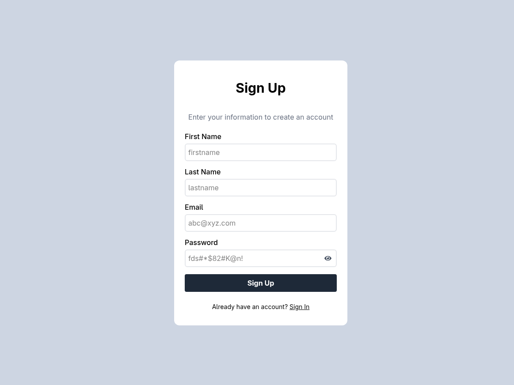
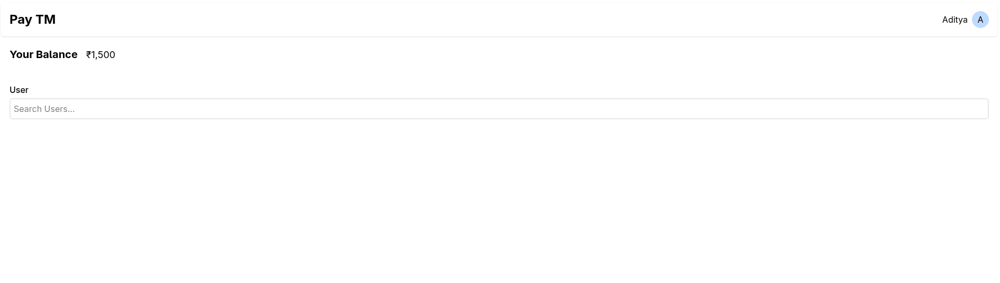
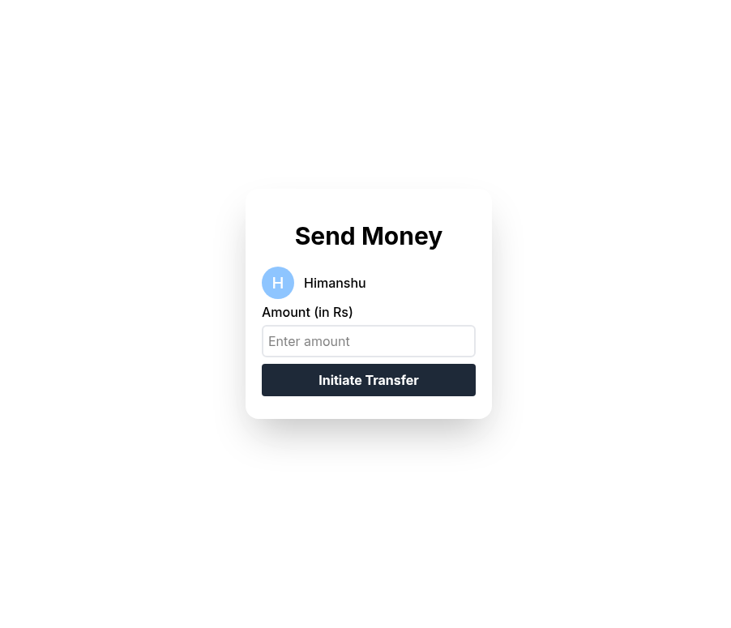

# PayTM Clone

A full-stack web application that mimics the basic functionalities of a digital wallet like PayTM. It provides a platform for users to manage their accounts and perform peer-to-peer money transfers securely.

## Overview

This project is a simplified clone of a payment application, built with a modern MERN-like stack. It allows users to sign up, sign in, view their account balance, find other users, and transfer money. The backend ensures that all transactions are atomic, maintaining data integrity.

## Features

-   **👤 User Authentication:** Secure sign-up and sign-in functionality using JWT (JSON Web Tokens).
## Tech Stack

**Frontend:**
-   [React](https://reactjs.org/)
-   [TypeScript](https://www.typescriptlang.org/)
-   [React Router](https://reactrouter.com/)
-   [TailwindCSS](https://tailwindcss.com/)
-   [Axios](https://axios-http.com/)

**Backend:**
-   [Node.js](https://nodejs.org/)
-   [Express.js](https://expressjs.com/)
-   [MongoDB](https://www.mongodb.com/)
-   [Mongoose](https://mongoosejs.com/)
-   [JSON Web Token (JWT)](https://jwt.io/)

## Project Structure

The project is organized into two main directories: `frontend` and `backend`.

```
paytm-clone/
├── backend/
│   ├── db.js             # MongoDB connection and schemas
│   ├── middleware.js     # Authentication middleware (authMiddleware)
│   └── routes/
│       ├── account.js    # Account-related routes (balance, transfer)
│       └── ...           # Other routes like user.js
│
└── frontend/
    ├── src/
    │   ├── components/   # Reusable React components
    │   ├── pages/        # Page components (Dashboard, Signin, etc.)
    │   └── App.tsx       # Main application component with routing
    └── package.json
```

## Installation

### Prerequisites

-   Node.js (v18.x or higher)
-   `npm` or `yarn`
-   MongoDB (local or a cloud instance)

### Steps to Run Locally

1.  **Clone the repository:**
    ```bash
    git clone https://github.com/your-username/paytm-clone.git
    cd paytm-clone
    ```

2.  **Setup the Backend:**
    ```bash
    cd backend
    npm install
    # Create a .env file and add the environment variables (see below)
    npm start
    ```
    The backend server will start on `http://localhost:3000`.

3.  **Setup the Frontend:**
    ```bash
    cd ../frontend
    npm install
    npm run dev
    ```
    The frontend development server will start on `http://localhost:5173` (or another available port).

## Environment Variables

The backend requires a `.env` file in the `/backend` directory with the following variables:

```env
# A secret key for signing JWT tokens
JWT_SECRET="your_jwt_secret_key"

# Your MongoDB connection string
DATABASE_URL="mongodb+srv://<username>:<password>@cluster0.your-cluster.mongodb.net/paytm"
```

## API Endpoints

The backend exposes the following REST API endpoints under the `/api/v1` prefix:

| Method | Endpoint          | Description                              | Auth Required |
| :----- | :---------------- | :--------------------------------------- | :-----------: |
| `POST` | `/user/signup`    | Register a new user.                     |      No       |
| `POST` | `/user/signin`    | Log in an existing user and get a token. |      No       |
| `GET`  | `/user/bulk`      | Get users based on a filter query.       |      Yes      |
| `GET`  | `/account/balance`| Get the current user's account balance.  |      Yes      |
| `POST` | `/account/transfer`| Transfer money to another user.          |      Yes      |

## Usage

1.  Navigate to the application URL (e.g., `http://localhost:5173`).
2.  **Sign Up:** Create a new account by providing your first name, last name, email, and password.
3.  **Sign In:** Log in with your email and password.
4.  **Dashboard:** After logging in, you'll see your dashboard with your current balance.
5.  **Find Users:** Use the search bar to find other users by their name.
6.  **Send Money:** Click the "Send Money" button next to a user, enter the amount, and initiate the transfer.

## Screenshots

| Sign In Page | Dashboard | Send Money |
| :----------: | :-------: | :--------: |
|  |  |  |

## Future Improvements

-   **Enhanced UI/UX:** Implement loading states and use a library like `react-hot-toast` for notifications instead of native `alert()`.
-   **Transaction History:** Add a feature for users to view their past transactions.
-   **Configuration Management:** Move the hardcoded API base URL in the frontend to an environment variable.


